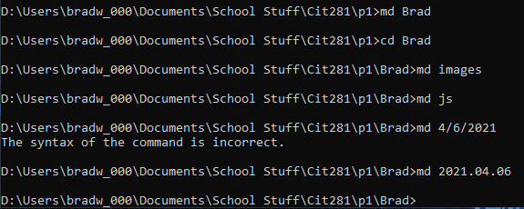
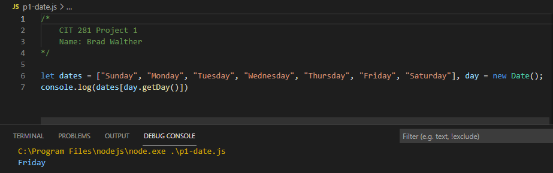
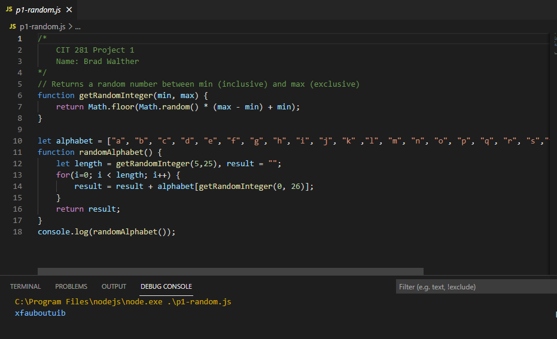

# Welcome to the Cit 281 Project 1 Page

### What I learned:

- Learned CLI commands in Windows Prompt.
- Gained experience working with Visual Studio Code.

### Purpose of Project:

- This project gave me a chance to work with CLI commands and to familiarize myself with them.
- Also gained experience coding with Visual Studio Code.
- Created functions using javascript and have functions output results.

### Outcome pics: 

### [**Back to home page**](https://uo-cit-itsbread33.github.io/ItsBread33.github.io/)
